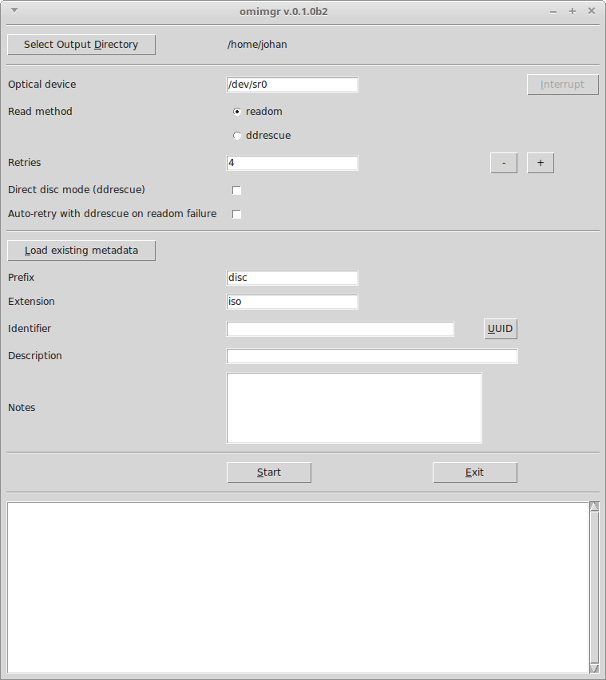
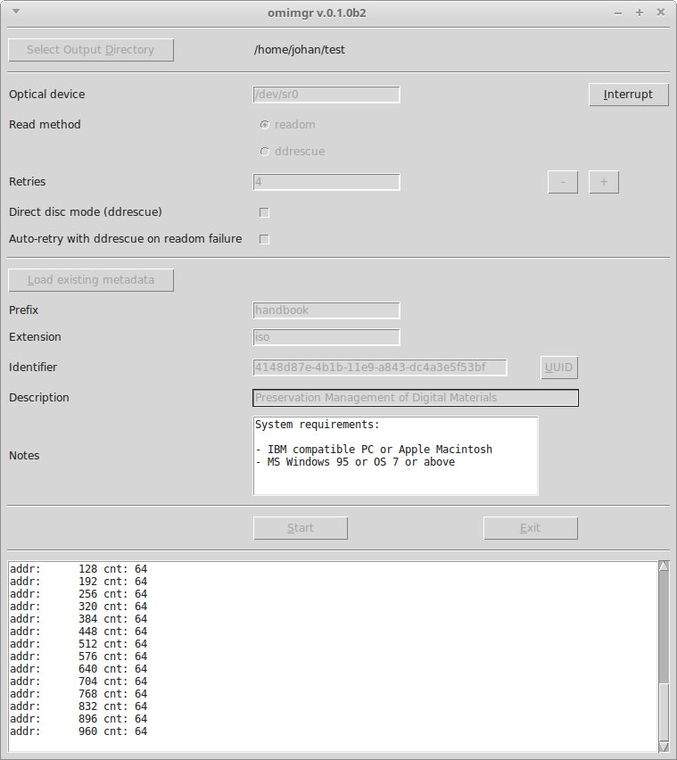
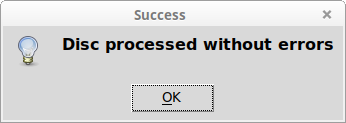
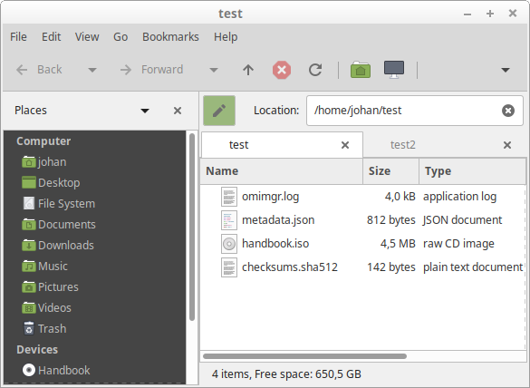
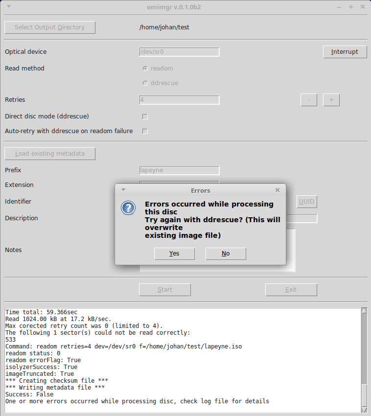

# omimgr

**Omimgr** provides a simple GUI-based workflow for making ISO images from optical media (CD-ROMs and DVDs). It wraps around the *readom* (part of [*Cdrkit*](https://en.wikipedia.org/wiki/Cdrkit)) and [*ddrescue*](https://linux.die.net/man/1/ddrescue) tools. After the imaging is done it also generates a checksum file with SHA-512 hashes of the extracted files. 

## System requirements

*Omimgr* is currently only available for Linux. So far it has been tested with Ubuntu 18.04 LTS (Bionic) and Linux Mint 18.3, which is based on Ubuntu 16.04 (Xenial). In addition it has the following dependencies:

- **Python 3.2 or more recent** (Python 2.x is not supported)

- **Tkinter**. If *tkinter* is not installed already, you need to use the OS's package manager to install (there is no PyInstaller package for *tkinter*). If you're using *apt* this should work:

        sudo apt-get install python3-tk

- **readom**, which is part of the *wodim* package. Use the following command to install it:

        sudo apt install wodim

- **ddrescue**, which can be installed using:

        sudo apt install gddrescue

## Installation

### Preparation: give non-root user permission to run readom

The *readom* documentation recommends to always run *readom* as root. To allow a non-root user to run *readom*, you must give them the permissions to do so using the two simple steps below (source [here](https://www.cyberciti.biz/tips/allow-non-root-user-to-write-cds.html); note that I'm not entirely sure step 1 is even necessary):

1. Set SUID-root on *wodim* (this is the package that contains *readom*):

        sudo dpkg-reconfigure wodim

2. Add user to *cdrom* group (replace $USER with the name of the user who will be using *omimgr*):

        sudo adduser $USER cdrom

The user is now added to the 'cdrom' system group. Now log out, and then log in again for the changes to take effect.

### Global install

For a global (all-users) installation run the following command:

    sudo pip3 install omimgr

Then run:

    sudo omimgr-config

If all goes well this should result in the following output:

    INFO: writing configuration file /etc/omimgr/omimgr.json
    INFO: creating desktop file /usr/share/applications/omimgr.desktop
    INFO: omimgr configuration completed successfully!

### User install

Use the following command for a single-user installation:

    pip3 install --user omimgr

Then run:

    ~/.local/bin/omimgr-config

Result:

    INFO: writing configuration file /home/johan/.config/omimgr/omimgr.json
    INFO: creating desktop file /home/johan/.local/share/applications/omimgr.desktop
    INFO: omimgr configuration completed successfully!

*Omimgr* is now ready to roll!

## Basic operation

You can start *omimgr* from the OS's main menu (in Ubuntu 18.04 the *omimgr* item is located under *System Tools*). Depending on your distro, you might get an "Untrusted application launcher" warning the first time you activate the shortcut. You can get rid of this by clicking on "Mark as Trusted". On startup the main *omimgr* window appears:

Use the *Select Output Directory* button to navigate to an (empty) directory where the output files are to be stored. The interface allows you to specify the following options:

|Option|Description|
|:-|:-|
|**Optical Device**|The optical devices that is used (default: `/dev/nst0`).|
|**Read method**|The method (application) that is used to read the disc (default: `readom`).|
|**Retries**|Maximum number of retries (default: `4`).|
|**Direct disc mode**|Check this option to read a disc in direct disc mode (setting only has effect with *ddrescue*) (disabled by default).|
|**Auto-retry with ddrescue on readom failure**|This checkbox controls the behaviour with discs that result in read errors with *readom*. If checked, *omimgr* will automatically re-try such a disc with *ddrescue*. Otherwise, *omimgr* will first display a confirmation dialog.|
|**Load existing metadata**|Loads *Prefix*, *Extension*, *Identifier*, *Description* and *Notes* values (see below) from an existing metadata file in the output directory that was created by a previous *omimgr* session. Useful for re-running discs that were previously interrupted or unfinished. If no metadata file can be found, *omimgr* will display an error, and the fields can be entered manually|
|**Prefix**|Output prefix (default: `disc`).|
|**Extension**|Output file extension (default: `iso`).|
|**Identifier**|Unique identifier. You can either enter an existing identifier yourself, or press the *UUID* button to generate a [Universally unique identifier](https://en.wikipedia.org/wiki/Universally_unique_identifier).|
|**Description**|A text string that describes the disc (e.g. a title that is written on the inlay card).|
|**Notes**|Any additional info or notes you want to record with the disc.|

Press the *Start* button to start imaging a disc. You can monitor the progress of the extraction procedure in the progress window:

Note that the screen output is also written to a log file in the output directory. A prompt appears when the imaging is finished:

If the imaging finished without any errors, the output directory now contains the following files:

Here, **handbook.iso** is the created ISO image; **checksums.sha512** contains the SHA512 checksums of the image, **metadata.json** contains some basic metadata and **omimgr.log** is the log file.

If *readom*'s attempt to read the disc resulted in any errors, *omimgr* prompts the user to try again with *ddrescue*:

After clicking *Yes*, *omimgr* will delete the disc image that was created by *readom*, and then start *ddrescue*. If *ddrescue* also exits with any errors, it is possible to do one or more additional passes with *ddrescue*:

After clicking *Yes*, you can activate *Direct Disc* mode, or select another optical drive. Press the *Start* button again to start reading the disc. Importantly, *omimgr* does not delete the existing disc image in this case, but it will update it with any additional data that can be rescued from the disc.

Note that *ddrescue* runs result in an additional [*mapfile*](https://www.gnu.org/software/ddrescue/manual/ddrescue_manual.html#Mapfile-structure) (**$prefix.map**). The map file contains information about the recovery status of data blocks, which allows *ddrescue* to resume previously interrupted recovery sessions. 

## Suggested workflow

In general *readom* is the preferred tool to read a CD-ROM or DVD. However, *readom* does not cope well with discs that are degraded or otherwise damaged. Because of this, the suggested workflow is to first try reading the disc with *readom*. If this results in any errors, try *ddrescue*. If you check the **Auto-retry** box, *omimgr* will automatically launch *ddrescue* if the initial attempt to read the disc with *readom* failed (i.e. it will not display the confirmation dialog).

It is possible to run multiple subsequent passes with *ddrescue*. If *ddrescue* fails with errors, it sometimes helps to re-run it in *Direct disc* mode (which can be selected from *omimgr*'s interface). The results can often be further improved by running multiple *ddrescue* passes with different optical devices (e.g. a few different external USB drives).

## Interrupting readom or ddrescue

Press the *Interrupt* button to interrupt any running *readom* or *ddrescue* instances. This is particularly useful for *ddrescue* runs, which may require many hours for discs that are badly damaged. Note that interrupting *ddrescue* will not result in any data loss. Interrupting *readom* will generally result in an unreadable ISO image. 

## Resuming an interrupted ddrescue run

Follow these steps to resume a *ddrescue* run that was previously interrupted:

1. After launching *omimgr*, set the output directory to the directory of the interrupted run.

2. Set **Read method** to *ddrescue*.

3. Click on the **Load existing metadata** button; this loads the previously entered *Prefix*, *Extension*, *Identifier*, *Description* and *Notes* values.

4. Hit the **Start** button. Now *ddrescue* will simply pick up on where the interrupted run stopped.

## Metadata file

The file *metadata.json* contains metadata in JSON format. Below is an example:

    {
        "acquisitionEnd": "2019-03-20T15:22:37.449475+01:00",
        "acquisitionStart": "2019-03-20T15:22:28.074038+01:00",
        "autoRetry": true,
        "checksumType": "SHA-512",
        "checksums": {
            "handbook.iso": "20eb93d8d0fa7fe24bd4debba6a0f1556c09a1b1c3a753bbf0d39445e72c3569e69e813c845629e1165ce57aa6d19ccb2b1a9df1a88fea9e7e464f6893fc7d02"
        },
        "description": "Preservation Management of Digital Materials",
        "extension": "iso",
        "identifier": "4148d87e-4b1b-11e9-a843-dc4a3e5f53bf",
        "imageTruncated": false,
        "interruptedFlag": false,
        "isolyzerSuccess": true,
        "maxRetries": "4",
        "notes": "System requirements:\n\n- IBM compatible PC or Apple Macintosh\n- MS Windows 95 or OS 7 or above",
        "omDevice": "/dev/sr0",
        "omimgrVersion": "0.1.0b2",
        "prefix": "handbook",
        "readCommandLine": "readom retries=4 dev=/dev/sr0 f=/home/johan/test/handbook.iso",
        "readMethod": "readom",
        "readMethodVersion": "readom 1.1.11 (Linux)",
        "rescueDirectDiscMode": false,
        "successFlag": true
    }

Most of these fields are self-explanatory, but the following need some further explanation:

- **imageTruncated** is a Boolean flag that is *true* if the ISO image is smaller than expected (which is an indication that the image is truncated/incomplete), and *false*. Its value is based on an analysis of the image with the [*Isolyzer*](https://github.com/KBNLresearch/isolyzer) tool.
- **isolyzerSuccess** is a Boolean flag that is *true* if *Isolyzer* ran successfully, and *false* otherwise.
- **interruptedFlag** is a Boolean flag that is *true* if *readom* or *ddrescue* were interrupted, and *false* otherwise.
- **successFlag** is a Boolean flag that is *true* if the disc was imaged without any problems, and *false* otherwise.

## Configuration file

*Omimgr*'s internal settings (default values for output file names, the optical device, etc.) are defined in a configuration file in Json format. For a global installation it is located at */etc/omimgr/omimgr.json*; for a user install it can be found at *~/.config/omimgr/omimgr.json*. The default configuration is show below:

    {
        "autoRetry": "False",
        "checksumFileName": "checksums.sha512",
        "defaultDir": "",
        "extension": "iso",
        "logFileName": "omimgr.log",
        "metadataFileName": "metadata.json",
        "omDevice": "/dev/sr0",
        "prefix": "disc",
        "readCommand": "readom",
        "rescueDirectDiscMode": "False",
        "retries": "4",
        "timeZone": "Europe/Amsterdam"
    }

You can change *omimgr*'s default settings by editing this file. Most of the above settings are self-explanatory, with the exception of the following:

- **autoRetry**: this flag  sets the default value of the *Auto-retry* checkbox.

- **defaultDir**: this allows you to change the default file path that is opened after pressing *Select Output Directory*. By default *omimgr* uses the current user's home directory. However, if *defaultDir* points to a valid directory path, that directory is used instead.

- **timeZone**: time zone string that is used to correctly format the *acquisitionStart* and *acquisitionEnd* date/time strings. You can adapt it to your own location by using the *TZ database name* from [this list of tz database time zones](https://en.wikipedia.org/wiki/List_of_tz_database_time_zones).

If you accidentally messed up the configuration file, you can always restore the original one by running the *omimgr-config* tool again.

## Uninstalling omimgr

To remove *omimgr*, first run the *omimgr-config* with the `--remove` flag to remove the configuration file and the start menu and desktop files. For a global install, run:

    sudo omimgr-config --remove

For a user install, run:

    ~/.local/bin/omimgr-config --remove

The resulting output (shown below for a user install):

    INFO: removing configuration file /home/johan/.config/omimgr/omimgr.json
    INFO: removing configuration directory /home/johan/.config/omimgr
    INFO: removing desktop file /home/johan/.local/share/applications/omimgr.desktop
    INFO: omimgr configuration completed successfully!

Then remove the Python package with following command (global install):

    sudo pip3 uninstall omimgr

For a user install use this:

    pip3 uninstall omimgr

## Contributors

Written by Johan van der Knijff. Some parts of the code that processes ddrescue's and readom's terminal output were adapted from [DDRescue-GUI](https://launchpad.net/ddrescue-gui) by Hamish McIntyre-Bhatty.

## License

*Omimgr* is released under the  Apache License 2.0.
