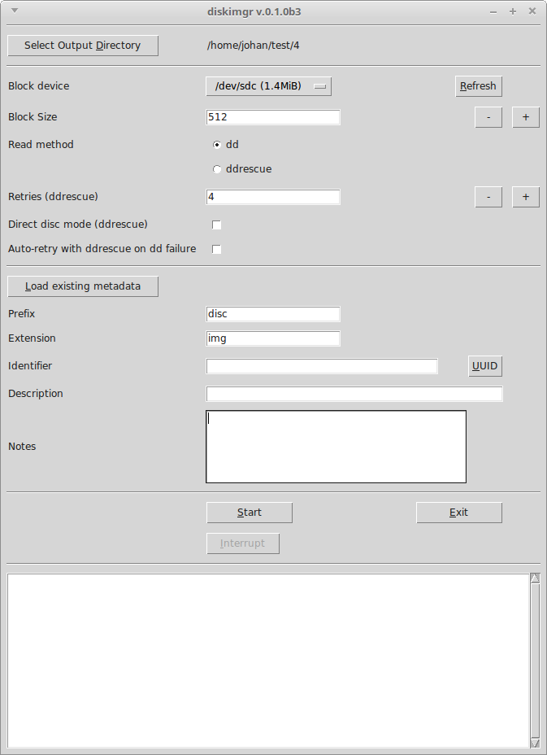
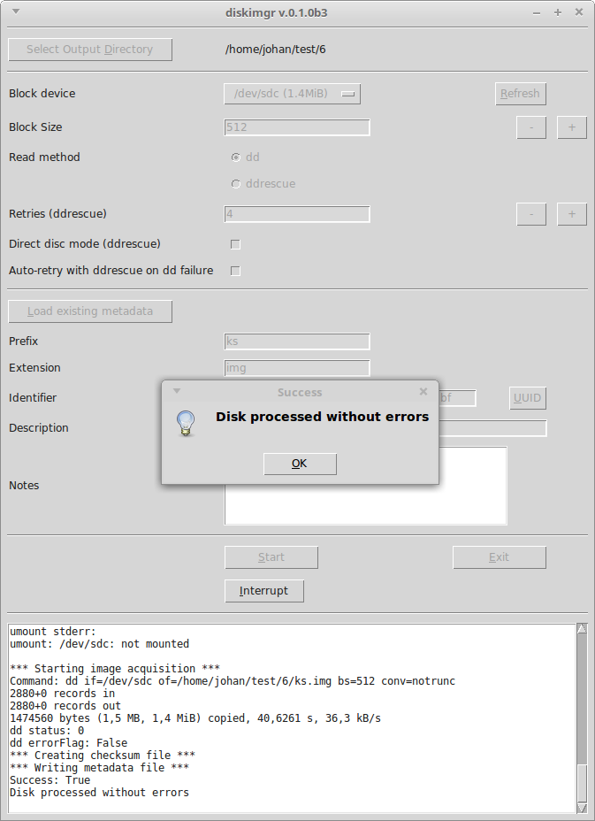

# diskimgr

**diskimgr** provides a simple GUI-based workflow for making disk images of digital media, such as floppy disks, Flash drives and harddisks. It wraps around the [*dd*](https://linux.die.net/man/1/dd) and [*ddrescue*](https://linux.die.net/man/1/ddrescue) tools. After the imaging is done it also generates a checksum file with SHA-512 hashes of the extracted files. 

## System requirements

*Diskimgr* is currently only available for Linux. So far it has been tested with Ubuntu 18.04 LTS (Bionic) and Linux Mint 18.3, which is based on Ubuntu 16.04 (Xenial). In addition it has the following dependencies:

- **Python 3.2 or more recent** (Python 2.x is not supported)

- **Tkinter**. If *tkinter* is not installed already, you need to use the OS's package manager to install (there is no PyInstaller package for *tkinter*). If you're using *apt* this should work:

        sudo apt-get install python3-tk

- **dd**, which is part of the [*GNU Core Utilities*](https://en.wikipedia.org/wiki/GNU_Core_Utilities).

- **ddrescue**, which can be installed using:

        sudo apt install gddrescue

## Installation

### Preparation: give non-root user permission to run dd

By default, running *dd* on a Linux system requires root access. To allow a non-root user to run *dd*, you must give them the permissions to do so by adding the user to the *disk* group. You can do this with the command below (replace $USER with the name of the user who will be using *diskimgr*):

        sudo adduser $USER disk

The user is now added to the 'disk' system group. Now log out, and then log in again for the changes to take effect.

### Global install

For a global (all-users) installation run the following command:

    sudo pip3 install diskimgr

Then run:

    sudo diskimgr-config

If all goes well this should result in the following output:

    INFO: writing configuration file /etc/diskimgr/diskimgr.json
    INFO: creating desktop file /usr/share/applications/diskimgr.desktop
    INFO: diskimgr configuration completed successfully!

### User install

Use the following command for a single-user installation:

    pip3 install --user diskimgr

Then run:

    ~/.local/bin/diskimgr-config

Result:

    INFO: writing configuration file /home/johan/.config/diskimgr/diskimgr.json
    INFO: creating desktop file /home/johan/.local/share/applications/diskimgr.desktop
    INFO: diskimgr configuration completed successfully!

*diskimgr* is now ready to roll!

## Basic operation

You can start *diskimgr* from the OS's main menu (in Ubuntu 18.04 the *diskimgr* item is located under *System Tools*). Depending on your distro, you might get an "Untrusted application launcher" warning the first time you activate the shortcut. You can get rid of this by clicking on "Mark as Trusted". On startup the main *diskimgr* window appears:

Use the *Select Output Directory* button to navigate to an (empty) directory where the output files are to be stored. The interface allows you to specify the following options:

|Option|Description|
|:-|:-|
|**Block Device**|Select the medium (device) you want to image from the drop-down list. Press the **Refresh** button to refresh the items in the drop-down list|
|**Block size**|This sets the size of the buffer (in bytes) that is used by *dd* / *ddrescue* default: `512`).|
|**Read method**|The method (application) that is used to read the medium (default: `dd`).|
|**Retries**|Maximum number of retries (setting only has effect with *ddrescue*) (default: `4`).|
|**Direct disc mode**|Check this option to read a medium in direct disc mode (setting only has effect with *ddrescue*) (disabled by default).|
|**Auto-retry with ddrescue on dd failure**|This checkbox controls the behaviour with media that result in read errors with *dd*. If checked, *diskimgr* will automatically re-try such a medium with *ddrescue*. Otherwise, *diskimgr* will first display a confirmation dialog.|
|**Load existing metadata**|Loads *Prefix*, *Extension*, *Identifier*, *Description* and *Notes* values (see below) from an existing metadata file in the output directory that was created by a previous *diskimgr* session. Useful for re-running media that were previously interrupted or unfinished. If no metadata file can be found, *diskimgr* will display an error, and the fields can be entered manually|
|**Prefix**|Output prefix (default: `disc`).|
|**Extension**|Output file extension (default: `img`).|
|**Identifier**|Unique identifier. You can either enter an existing identifier yourself, or press the *UUID* button to generate a [Universally unique identifier](https://en.wikipedia.org/wiki/Universally_unique_identifier).|
|**Description**|A text string that describes the medium (e.g. a title that is written on the label of a floppy disk).|
|**Notes**|Any additional info or notes you want to record with the medium.|

Press the *Start* button to start imaging a medium. You can monitor the progress of the extraction procedure in the progress window:

Note that the screen output is also written to a log file in the output directory. A prompt appears when the imaging is finished:

If the imaging finished without any errors, the output directory now contains the following files:

Here, **ks.img** is the created ISO image; **checksums.sha512** contains the SHA512 checksums of the image, **metadata.json** contains some basic metadata and **diskimgr.log** is the log file.

If *dd*'s attempt to read the disc resulted in any errors, *diskimgr* prompts the user to try again with *ddrescue*:

After clicking *Yes*, *diskimgr* will move the disc image that was created by *dd* to a subdirectory *dd-failed*, and then start *ddrescue*. If *ddrescue* also exits with any errors, you will see this dialog:

From *ddrescue*'s output, you can see that 106 kB of data could not be recovered (value of *errsize* variable). After pressing *Yes*, you can do one or more additional passes with *ddrescue*. For instance, you can activate *Direct Disc* mode, or select another floppy drive. Press the *Start* button again to start reading the medium. Importantly, this won't overwrite the existing image, but it will update it with any additional data that can be rescued from the medium. As an example, below is the result of the second *ddrescue* pass, where *Direct Disc* mode was activated:

In this case *ddrescue* still reports a read error, but now *errsize* is reduced from 106 kB to just 512 bytes, which means that only one sector could not be recovered.

Note that *ddrescue* runs result in an additional [*mapfile*](https://www.gnu.org/software/ddrescue/manual/ddrescue_manual.html#Mapfile-structure) (**$prefix.map**). The map file contains information about the recovery status of data blocks, which allows *ddrescue* to resume previously interrupted recovery sessions. 

## Suggested workflow

In general *dd* is the preferred tool to read a floppy disk, flash drive or harddisk. However, *dd* does not cope well with media that are degraded or otherwise damaged. Because of this, the suggested workflow is to first try reading the medium with *dd*. If this results in any errors, try *ddrescue*. If you check the **Auto-retry** box, *diskimgr* will automatically launch *ddrescue* if the initial attempt to read the medium with *dd* failed (i.e. it will not display the confirmation dialog).

It is possible to run multiple subsequent passes with *ddrescue*. If *ddrescue* fails with errors, it sometimes helps to re-run it in *Direct disc* mode (which can be selected from *diskimgr*'s interface). The results can sometimes be further improved by running multiple *ddrescue* passes with different reader devices (e.g. a few USB-connected floppy drives).

## Interrupting dd or ddrescue

Press the *Interrupt* button to interrupt any running *dd* or *ddrescue* instances. This is particularly useful for *ddrescue* runs, which may require many hours for media that are badly damaged. Note that interrupting *ddrescue* will not result in any data loss. Interrupting *dd* will generally result in an unreadable image file. 

## Resuming an interrupted ddrescue run

Follow these steps to resume a *ddrescue* run that was previously interrupted:

1. After launching *diskimgr*, set the output directory to the directory of the interrupted run.

2. Set **Read method** to *ddrescue*.

3. Click on the **Load existing metadata** button; this loads the previously entered *Prefix*, *Extension*, *Identifier*, *Description* and *Notes* values.

4. Hit the **Start** button. Now *ddrescue* will simply pick up on where the interrupted run stopped.

## Metadata file

The file *metadata.json* contains metadata in JSON format. Below is an example:

    {
        "acquisitionEnd": "2019-04-04T17:53:11.489543+02:00",
        "acquisitionStart": "2019-04-04T17:52:29.692731+02:00",
        "autoRetry": false,
        "blockDevice": "/dev/sdb",
        "checksumType": "SHA-512",
        "checksums": {
            "ks.img": "79a17d3fa536b8fa750257b01d05124dadb888f1171e9ca5cc3398a2c16de81b1687b52c70135b966409a723ef5f3960536a6e994847c5ebe7d5eaffefa62dc7"
        },
        "description": "KS metingen origineel",
        "diskimgrVersion": "0.1.0b1",
        "extension": "img",
        "identifier": "5b159d32-56f1-11e9-9abb-2c4138b5272c",
        "interruptedFlag": false,
        "maxRetries": "4",
        "notes": "",
        "prefix": "ks",
        "readCommandLine": "dd if=/dev/sdb of=/home/bcadmin/test/1/ks.img bs=512 conv=notrunc",
        "readMethod": "dd",
        "readMethodVersion": "dd (coreutils) 8.28",
        "rescueDirectDiscMode": false,
        "successFlag": true
    }

Most of these fields are self-explanatory, but the following need some further explanation:

- **interruptedFlag** is a Boolean flag that is *true* if *dd* or *ddrescue* were interrupted, and *false* otherwise.
- **successFlag** is a Boolean flag that is *true* if the medium was imaged without any problems, and *false* otherwise.

## Configuration file

*Diskimgr*'s internal settings (default values for output file names, the optical device, etc.) are defined in a configuration file in Json format. For a global installation it is located at */etc/diskimgr/diskimgr.json*; for a user install it can be found at *~/.config/diskimgr/diskimgr.json*. The default configuration is show below:

    {
        "autoRetry": "False",
        "blockSize": "512",
        "checksumFileName": "checksums.sha512",
        "defaultDir": "",
        "extension": "img",
        "logFileName": "diskimgr.log",
        "metadataFileName": "metadata.json",
        "prefix": "disc",
        "rescueDirectDiscMode": "False",
        "retries": "4",
        "timeZone": "Europe/Amsterdam"
    }

You can change *diskimgr*'s default settings by editing this file. Most of the above settings are self-explanatory, with the exception of the following:

- **autoRetry**: this flag  sets the default value of the *Auto-retry* checkbox.

- **defaultDir**: this allows you to change the default file path that is opened after pressing *Select Output Directory*. By default *diskimgr* uses the current user's home directory. However, if *defaultDir* points to a valid directory path, that directory is used instead.

- **timeZone**: time zone string that is used to correctly format the *acquisitionStart* and *acquisitionEnd* date/time strings. You can adapt it to your own location by using the *TZ database name* from [this list of tz database time zones](https://en.wikipedia.org/wiki/List_of_tz_database_time_zones).

If you accidentally messed up the configuration file, you can always restore the original one by running the *diskimgr-config* tool again.

## Uninstalling diskimgr

To remove *diskimgr*, first run the *diskimgr-config* with the `--remove` flag to remove the configuration file and the start menu and desktop files. For a global install, run:

    sudo diskimgr-config --remove

For a user install, run:

    ~/.local/bin/diskimgr-config --remove

The resulting output (shown below for a user install):

    INFO: removing configuration file /home/johan/.config/diskimgr/diskimgr.json
    INFO: removing configuration directory /home/johan/.config/diskimgr
    INFO: removing desktop file /home/johan/.local/share/applications/diskimgr.desktop
    INFO: diskimgr configuration completed successfully!

Then remove the Python package with following command (global install):

    sudo pip3 uninstall diskimgr

For a user install use this:

    pip3 uninstall diskimgr

## Contributors

Written by Johan van der Knijff. Some parts of the code that processes ddrescue's terminal output were adapted from [DDRescue-GUI](https://launchpad.net/ddrescue-gui) by Hamish McIntyre-Bhatty.

## License

*Diskimgr* is released under the  Apache License 2.0.